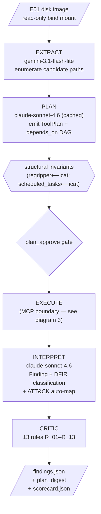
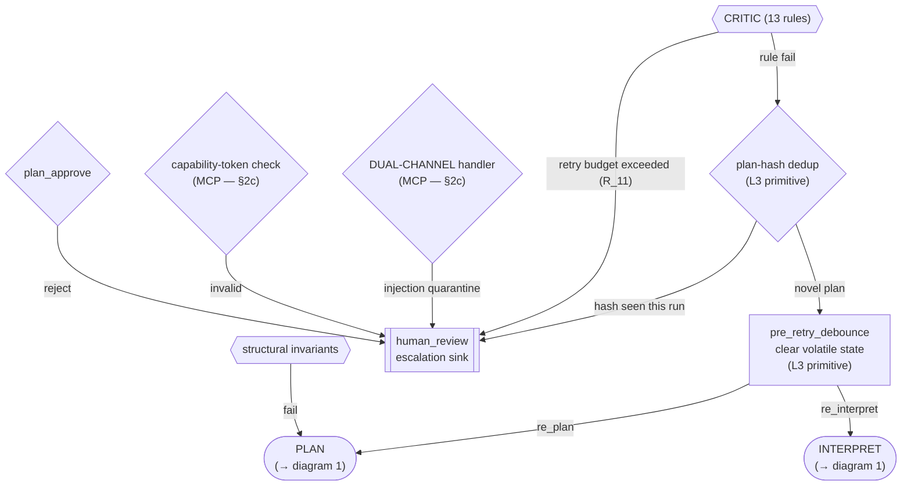
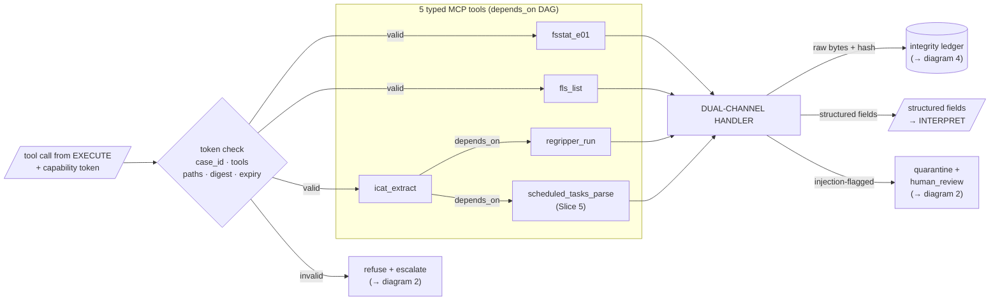
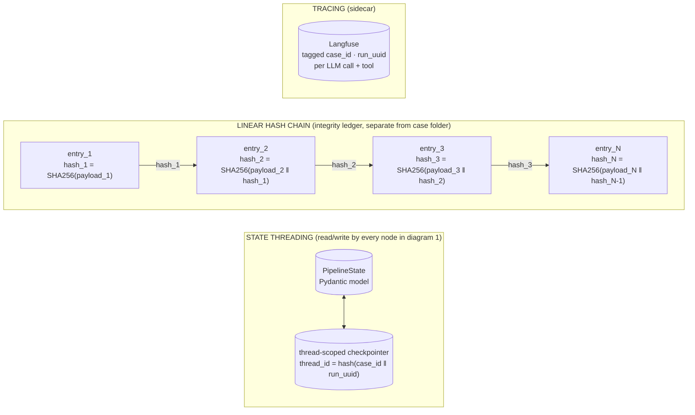

# Architecture — Find Evil Hackathon (Detailed Reference)

**Last updated:** 2026-04-20
**Companion to:** [architecture.md](architecture.md) (tight submission view), [PLAN.md](PLAN.md) (slices + status)
**Audience:** maintainers and reviewers who need full implementation-level detail.

> This is the maintainer-facing long form. For the judge-facing at-a-glance view, see [architecture.md](architecture.md) and the HTML diagram at [architecture.html](architecture.html).

This document is the full architectural reference. It explains the pipeline, trust boundaries, state schema, tool surface, and Critic catalog in enough detail that a reviewer can trace any finding back to its producing component. Where concrete implementation lives in a specific notebook cell or module, we say so by name.

Status legend used throughout: ✅ shipped • 🟡 runbook-ready, implementation in progress • ⬜ scope defined, not built

---

## 1. Component map

| Component | Role | Physical location | Status |
|---|---|---|---|
| `EXTRACT` node | Enumerate candidate artifact paths from the E01 given the investigation question | [`slice2.ipynb`](../../experiments/slice-2-notebook/slice2.ipynb) cell C5 — model `google/gemini-3.1-flash-lite-preview` via OpenRouter, JSON mode | ✅ |
| `PLAN` node | Emit a typed `ToolPlan` (tool-call sequence with `depends_on` DAG) | `slice2.ipynb` C6 — model `anthropic/claude-sonnet-4.6` via OpenRouter, prompt-cached | ✅ |
| Structural-invariants check | Post-PLAN static validation (e.g. every `regripper_run` must have `icat_extract` upstream) | `slice2.ipynb` C6 | ✅ |
| `plan_approve` gate | Human approves the PLAN before any tool runs (L1/L2) | LangGraph conditional edge | ✅ |
| `EXECUTE` node | Run each tool in plan order via an MCP client | `slice2.ipynb` C8 + [`mcp_server/server.py`](../../experiments/slice-2-notebook/mcp_server/server.py) | ✅ |
| MCP server | Local stdio-transport MCP server, exposes 5 typed forensic tools | `mcp_server/server.py` (inside the SIFT Docker container) | ✅ 4 tools / 🟡 5th tool |
| Capability-token verification | Per-plan token scoped to `(case_id, allowed_tools, allowed_paths, plan_digest, expires_at)` | `mcp_server/server.py` | 🟡 Slice 5 |
| Dual-channel evidence handler | Raw bytes → integrity ledger; structured fields → agent context; suspicious content → quarantine + escalate | `mcp_server/server.py` | 🟡 Slice 5 |
| `INTERPRET` node | Synthesize typed `Finding` objects with DFIR classification + auto-populated MITRE ATT&CK fields | `slice2.ipynb` C9 — model `anthropic/claude-sonnet-4.6` | ✅ |
| `CRITIC` node | 13 deterministic Python rules over the finding set | `slice2.ipynb` C10 + C11 (orchestrator) | ✅ 11 rules / 🟡 +2 Phase C |
| `human_review` node | Escalation sink for Low-confidence findings, plan-hash-repeat detection, or Critic fail-fast events | `slice2.ipynb` C4 (topology) | ✅ |
| `pre_retry_debounce` node | Context-clearing step before each retry edge (L3 primitive) | C4 (Phase C scope) | 🟡 |
| Thread-scoped checkpointer | LangGraph checkpointer with `thread_id = hash(case_id ‖ run_uuid)` | C4 (Phase C scope) | 🟡 |
| Integrity ledger | Append-only store of linear-hash-chained ledger entries (SHA-256 of entry N embeds SHA-256 of entry N-1), **separate from case folder** | Slice 6 | ⬜ |
| `verify_chain_of_custody.py` | Replay tool — walks the chain, passes or fails loudly | Slice 6 | ⬜ |
| Langfuse tracing | Every LLM call and tool invocation traced with case_id + run_uuid tags | Throughout | ✅ |
| `score.py` | Precision/recall/hallucination scorer + Slice-6 autonomy-metric extensions | [`experiments/slice-2-notebook/score.py`](../../experiments/slice-2-notebook/score.py) | ✅ base / 🟡 autonomy metrics |

---

## 2. Pipeline diagrams

Four focused diagrams, each with one narrative. Reading in order gives the full picture; each one stands alone if you only need a slice.

1. **Happy path** (2a) — the main pipeline when nothing goes wrong.
2. **Retry + escalation** (2b) — what happens when any gate fails.
3. **MCP boundary zoom** (2c) — what lives inside the EXECUTE box of diagram 1.
4. **Audit + state threading** (2d) — cross-cutting concerns (state, checkpointer, hash chain, tracing) that every node in diagram 1 touches.

---

### 2a. Happy path

The linear flow when every gate passes. No retries, no escalation, no audit sidecar — those live in diagrams 2 and 4. EXECUTE is shown as one box here; diagram 3 zooms in.



ASCII, for terminal readers:

```
E01 ─▶ EXTRACT ─▶ PLAN ─▶ invariants ─▶ plan_approve ─▶ EXECUTE ─▶ INTERPRET ─▶ CRITIC ─▶ findings.json
       (gemini)   (sonnet)               (L1/L2 gate)    (MCP — §2c) (sonnet)     (13 rules)  (+ plan_digest)
```

---

### 2b. Retry + escalation paths

Only the failure routing. Every failure path ultimately converges on `human_review`; three of them first try a bounded retry via the L3 primitives (`plan-hash dedup` + `pre_retry_debounce`). `PLAN` and `INTERPRET` are shown as stadium shapes to signal they loop back into diagram 1.



---

### 2c. MCP boundary zoom

What lives inside the EXECUTE box from diagram 1. Flow is left-to-right. The `depends_on` DAG between the 5 tools is explicit here — `icat_extract` is upstream of both `regripper_run` and `scheduled_tasks_parse` (neither can run without a file extracted first). After tools run, the **dual-channel handler** splits output into three streams: raw bytes to the integrity ledger, structured fields to the agent, injection-flagged content to quarantine.



---

### 2d. Audit + state threading (cross-cutting concerns)

These components aren't steps in the pipeline — they're read/written by every node in diagram 1. Showing them separately keeps the main flow clean.

- **State threading:** every LangGraph node reads and writes `PipelineState`; the thread-scoped checkpointer binds `thread_id` to `(case_id, run_uuid)`. Critical: reusing a thread_id across different cases causes cross-case state contamination — a fatal forensic-integrity failure. See §5 for field-level write/read discipline.
- **Linear hash chain:** each integrity-ledger entry embeds the SHA-256 of the previous entry's payload. If one historical byte is altered, its hash changes; that hash is embedded in the next entry; the next entry's hash changes too; the chain is broken from that point onward. This is the mathematical non-repudiation the submission claims — not plain append-only storage.
- **Tracing:** Langfuse captures every LLM call and tool invocation, tagged with `(case_id, run_uuid)`. Sidecar to every stage, no control-flow dependency.



---

## 3. Trust boundaries and threat model

The architecture layers four distinct boundaries. Each one catches a different failure class; none is load-bearing alone.

### 3a. In scope (adversaries we defend against)

- **Malicious evidence content.** An E01 authored by an adversary may embed prompt-injection text in filenames, registry values, document bodies, or any string field. When `fls_list` or `regripper_run` emits that string, a naive pipeline would pipe it into the LLM context as part of tool output. **Defense: dual-channel handler.**
- **LLM-internal failure modes.** Sycophantic confirmation (agent assumes persistence exists because the question implies it), specification drift (agent wanders from TA0003 to lateral movement), silent tool-failure swallowing (agent treats empty output as clean), hallucinated relationships between real strings. **Defense: 13-rule Critic + Hadi3 negative-case validation.**
- **Accidental agent drift and poorly-formed plans.** Agent proposes to run `icat_extract` on a path outside the case folder, or calls a tool not in the approved set. **Defense: capability tokens at the MCP boundary.**

### 3b. Explicitly out of scope

- **Local root compromise** of the Docker container or host. Once an attacker has UID 0 on the host or escapes the container, the whole integrity story falls over. The integrity ledger separation (§6) raises the bar — historical entries can't be silently rewritten without breaking the hash chain — but we're not claiming seccomp/microVM-grade isolation.
- **Supply-chain attacks** on Python packages, Docker base images, or model providers.
- **Network-layer attackers** on the host.
- **Courtroom admissibility.** Protocol SIFT itself is experimental per SANS. We describe these mechanisms as *replayable auditability for a research workflow*, not proxies for legal admissibility.

### 3c. The stdio-transport nuance

In our deployment, the LangGraph orchestrator and the MCP server run in the same Docker container under the same UID. An adversary that fully hijacks the agent's reasoning (via a successful prompt injection that slips past the dual-channel handler) could, in principle, escape to the Python runtime and issue arbitrary `subprocess` calls — capability tokens can't prevent that because the agent is on the inside of the MCP transport.

**This is explicitly acknowledged in the submission.** Capability tokens are advertised as *application-layer least-privilege routing* — they prevent the LLM from logically requesting an out-of-scope tool. They are **not** a cryptographic boundary against adversarial breakout. The actual adversarial-injection defense is the dual-channel handler, which keeps injection strings out of the LLM context in the first place — a hijacked agent is a hijacked agent we never have, because the hijack payload never reaches it.

Full isolation in stdio would require seccomp-BPF, eBPF-LSM, or microVM wrapping (e.g., Firecracker, gVisor). Documented as an extension point in the submission; not in scope for an 8-week hackathon.

---

## 4. Data flow — one case end to end

1. **Analyst places E01 in the case folder.** Read-only bind-mounted into the container at `/cases/<case_id>/evidence/`. The human opens [`slice2.ipynb`](../../experiments/slice-2-notebook/slice2.ipynb) and sets `CASE_ID`.
2. **`EXTRACT` runs** (C5). Gemini 3.1 Flash Lite takes the investigation question + `fsstat_e01` summary, emits a JSON list of candidate artifact paths it expects to find persistence in.
3. **`PLAN` runs** (C6). Claude Sonnet 4.6 takes the candidate list + available MCP tools + inline `ToolPlan` schema, emits a typed sequence of tool calls with a `depends_on` DAG.
4. **Structural invariants check** (C6). Every `regripper_run` must have an `icat_extract` upstream; every `scheduled_tasks_parse` must have an `icat_extract` of the Tasks directory upstream; every tool call's `allowed_path` must resolve inside the case folder. Fail → back to PLAN.
5. **`plan_approve` gate.** At L1/L2, the human reviews the plan. L3 submission target: the gate reads from a confidence-rubric + policy file rather than blocking on a human approval.
6. **`EXECUTE` runs** (C8). Each tool call is dispatched to the MCP server over stdio with a capability token in the request header.
7. **Capability-token check** ([`mcp_server/server.py`](../../experiments/slice-2-notebook/mcp_server/server.py)). Server validates `(case_id, tool_name, paths, plan_digest, expiry)` against the token. Failure → refuse + escalate.
8. **Tool runs.** `fsstat_e01` / `fls_list` / `icat_extract` / `regripper_run` / `scheduled_tasks_parse`. Raw stdout/stderr bytes are captured.
9. **Dual-channel split** (Slice 5 boundary). The raw bytes are hashed and written to the integrity ledger with `prev_entry_hash` embedded. Structured fields are server-side-extracted (parsed registry keys, file paths, timestamps, ATT&CK-relevant fields) into an `EvidenceRecord`. Content matching injection patterns is flagged — the raw record is preserved, but the structured extract substitutes a safe placeholder and the case is escalated to `human_review`.
10. **`INTERPRET` runs** (C9). Claude Sonnet 4.6 receives only the structured `EvidenceRecord` fields. It emits typed `Finding` objects. A Pydantic `model_validator` auto-populates `attack_id` / `attack_tactic_id` from the `category` field — the LLM's output on ATT&CK fields is discarded.
11. **`CRITIC` runs** (C10 + C11). 13 deterministic Python rules run in parallel over the Finding set. Each rule returns `pass` / `fail` with an optional corrective-instruction template. See §7 for the catalog.
12. **Critic verdict routing.**
    - All pass → commit. `findings.json` + `plan_digest` written; final ledger entry closes the chain.
    - Any fail → plan-hash dedup check. If the proposed corrective would yield a plan whose hash matches a previous failed attempt on this run → route to `human_review` (prevents infinite sycophantic retry). Otherwise → `pre_retry_debounce` node clears volatile state keys (prior tool outputs, error traces) and routes to `re_plan` or `re_interpret` as the corrective dictates.
13. **Terminal state.** Findings committed or escalated. Langfuse trace closed. `scorecard.json` computed (§6). Thread checkpoint can be resumed with the same `(case_id, run_uuid)` without cross-contamination.

---

## 5. `PipelineState` schema

A single Pydantic model threaded through every LangGraph node. Field-level write/read discipline:

| Field | Type | Written by | Read by | Purpose |
|---|---|---|---|---|
| `case_id` | `str` | (initial) | all | Case identifier — bound into capability tokens + thread_id |
| `run_uuid` | `UUID` | (initial) | all | Per-run UUID — bound into thread_id for checkpointer isolation |
| `investigation_question` | `str` | (initial) | `EXTRACT`, `PLAN`, `INTERPRET` | The committed Q1 (or Q2 stretch) |
| `extract_candidates` | `list[CandidatePath]` | `EXTRACT` | `PLAN` | Paths the EXTRACT LLM proposes investigating |
| `tool_plan` | `ToolPlan \| None` | `PLAN` | `EXECUTE`, dedup | Typed tool-call sequence with `depends_on` DAG |
| `tool_plan_hash` | `str \| None` | `PLAN` → `CRITIC` | `dedup` | SHA-256 of the **canonicalized** plan (see §5.1) — drives L3 dedup primitive |
| `plan_approved` | `bool` | human gate | `EXECUTE` | Slice-phase-dependent: always `True` at L3 |
| `tool_results` | `list[EvidenceRecord]` | `EXECUTE` / dual-channel | `INTERPRET`, `CRITIC` | Structured-field extracts only — never raw injection content |
| `tool_execution_status` | `dict[str, str]` | `EXECUTE` | `CRITIC` (R_12) | Per-tool: `ok` / `timeout` / `permission_denied` / `parse_error` |
| `findings` | `list[Finding]` | `INTERPRET` | `CRITIC` | Typed findings with classification + ATT&CK fields |
| `critic_decisions` | `list[CriticDecision]` | `CRITIC` | audit, dedup | Per-rule pass/fail + corrective-instruction payload |
| `corrective_instruction` | `str \| None` | `CRITIC` | `PLAN` / `INTERPRET` on retry | Injected as a second system block (preserves prompt caching) |
| `retry_count` | `int` | `CRITIC` | routing | Bounded retry budget — exceeds budget → `human_review` |
| `plan_hash_history` | `list[str]` | `CRITIC` | dedup | All plan-hashes seen this run — dedup compares against |
| `audit_log` | `list[AuditEntry]` | all nodes | audit | Append-only record of every transition |

### 5.1 `tool_plan_hash` canonicalization

A naive SHA-256 over raw `ToolPlan` text would not work. LLMs produce byte-level variation between generations even at temperature 0: trailing whitespace, JSON key reordering, optional fields filled-vs-omitted, path casing (`C:\Users` vs `c:\users` on NTFS). Any of those would make semantically-identical plans hash differently and the repeat guard would let a duplicate through.

The plan hash is therefore computed over a **canonical form** of the Pydantic `ToolPlan`, not its raw serialization:

```python
canonical = tool_plan.model_dump(mode='json', exclude_none=True)
canonical_str = json.dumps(canonical, sort_keys=True, separators=(',', ':'))
tool_plan_hash = hashlib.sha256(canonical_str.encode()).hexdigest()
```

This normalizes:

- **Key ordering** via `sort_keys=True`.
- **Whitespace** via `separators=(',', ':')` (strips all).
- **Optional fields** via `exclude_none=True` ("omitted" ≡ "explicit None").
- **Type coercion** — Pydantic coerces `"1"` → `1` for int fields before dump.

**Still required, not yet wired:** every path string inside the plan (`allowed_paths`, tool-call `path` arguments) must pass through `os.path.normcase` + `os.path.normpath` before entering the canonical form, otherwise `C:\Users\…` and `c:\users\…` hash differently despite being the same NTFS path.

**Fail-fast probe before shipping retry logic:**

```python
# d:/tmp/probe_plan_hash_canonicalization.py
plan_a = ToolPlan.model_validate({...})              # canonical keys + "C:\..."
plan_b = ToolPlan.model_validate({...})              # reordered keys + trailing spaces + "c:\..."
assert hash_plan(plan_a) == hash_plan(plan_b), "canonicalization broken"
```

Run against the live container venv. If the assertion fails, the repeat guard is decorative — sycophantic retries will slip past the hash check and burn the full R_11 retry budget.

---

## 6. MCP tool surface

Five typed forensic tools exposed by `mcp_server/server.py`. Each has a strict input schema, a capability-token check, and (post-Slice-5) a structured-field output contract.

| Tool | Purpose | Input (key fields) | Structured output | Token-checked | Added |
|---|---|---|---|---|---|
| `fsstat_e01` | NTFS filesystem metadata for an E01 | `case_id`, `image_path` | `fs_type`, `cluster_size`, `mft_offset`, `volume_serial`, `bytes_per_sector` | ✅ | Slice 1 |
| `fls_list` | List files + MFT entries in a directory | `case_id`, `image_path`, `inode_or_path` | `entries: list[{inode, name, type, size, mtime, ctime, atime, crtime, deleted}]` | ✅ | Slice 2 |
| `icat_extract` | Extract a file by inode to `<case>/analysis/extracted/` | `case_id`, `image_path`, `inode`, `dest_name` | `extracted_path`, `size_bytes`, `sha256` | ✅ | Slice 2 |
| `regripper_run` | Run a RegRipper plugin against an extracted hive | `case_id`, `hive_path` (pinned to `<case>/analysis/extracted/`), `plugin` (7-plugin allowlist) | `plugin`, `hive`, `keys: list[{path, last_write, values, notes}]` | ✅ | Slice 2 |
| `scheduled_tasks_parse` | Parse XML files extracted from `C:\Windows\System32\Tasks\` | `case_id`, `tasks_dir` | `tasks: list[{name, author, command, triggers, last_run_time, next_run_time}]` — maps to MITRE T1053.005 | ✅ | 🟡 Slice 5 |

**Every tool's structured output also surfaces:**
- `tool_execution_status` — `ok` / `timeout` / `permission_denied` / `parse_error` (feeds Critic rule R_12)
- `expected_paths_covered` — the checklist of paths the tool was meant to examine (feeds R_06)
- `raw_bytes_hash` — SHA-256 of the raw stdout bytes written to the integrity ledger

---

## 7. Critic rule catalog (13 rules, R_01–R_13)

Rules are pure Python functions operating on `(state, finding) → CriticDecision`. Each failure returns a corrective-instruction template that gets injected as a second system block on retry.

| Rule | Category | What it catches | Added |
|---|---|---|---|
| R_01 | Schema | `Finding` fails Pydantic validation | Phase B |
| R_02 | Hallucination | `output_excerpt` text does not appear verbatim in any `tool_results` entry for this case | Phase B |
| R_03 | Path consistency | `finding.path` is outside the case-folder tree, or references a path never listed by `fls_list` | Phase B |
| R_04 | Tool-match | `finding.source_tool` does not match any tool in `tool_plan` | Phase B |
| R_05 | Scope | Finding falls outside the committed investigation question (persistence → TA0003 only) | Phase B |
| R_06 | **Negative-Result-Metadata (enhanced Phase C)** | When a tool emits `expected_paths_covered`, every path in the checklist must be acknowledged in the findings (positively or as `NOT_FOUND`) before the run can terminate. Converts "agent thinks it's done" into "agent proves coverage." | Phase B + enhanced Phase C |
| R_07 | Classification | Every `Finding` must have a non-null `classification` (attacker_persistence / legitimate_responder_tool / vendor_default / windows_default) | Phase B |
| R_08 | Masquerading | A finding classified `attacker_persistence` must include a rationale in `notes` when it matches a known DFIR-responder or vendor-default signature | Phase B |
| R_09 | ATT&CK consistency | `attack_id` must match the `category` per the model_validator mapping (defense-in-depth — the validator runs, this rule checks it ran) | Phase B |
| R_10 | Injection-flag propagation | If the dual-channel handler flagged any `tool_result` as quarantined, no `Finding` derived from that result may be committed — must escalate | Phase B |
| R_11 | Retry-budget | Current `retry_count` ≤ budget (default 2) | Phase B |
| R_12 | **Evidence-of-Absence vs Absence-of-Evidence (Phase C)** | A `NOT_FOUND` finding is only valid if the source tool's `tool_execution_status` is `ok`. If the tool timed out, hit a permission error, or failed to parse, the finding must route to `human_review` — silent tool failure ≠ clean result | Phase C |
| R_13 | **Temporal Consistency (Phase C)** | Agent-asserted timestamps in finding narratives must fall within the range of raw `fsstat_e01` / hive-LastWrite timestamps from the structured extract. Detects hallucinated relationships between real strings | Phase C |

**Rules still covered by slice-3-runbook.md** with concrete test fixtures — see [`slice-3-runbook.md`](../runbooks/slice-3-runbook.md) for the fail/pass examples per rule.

---

## 8. Autonomy-climb mapping

Which components activate at which autonomy level. L4 (post-deployment Forensic Auditor) is **not** in the submission narrative.

| Component | L1 Assisted | L2 Guarded | L3 Exception-Based |
|---|---|---|---|
| `plan_approve` gate | Human always | Human always | Policy file (auto-approve unless flagged) |
| Critic retry loop | Disabled — fail → human | Enabled with bounded retry | Enabled + plan-hash dedup + debounce |
| MCP capability tokens | Per-plan | Per-plan | Per-plan with shorter expiry |
| Dual-channel handler | Active | Active | Active |
| Thread-scoped checkpointer | Optional | Recommended | Required (primitive 3) |
| Integrity ledger | Per-step | Per-step | Per-step + replay-verified at run end |
| Confidence rubric | Advisory | Advisory + escalate Low | Auto-escalate Low to `human_review` |

The climb is a transfer of control from human to agent **only** as compensating controls land. The submission headline is **L2 shipped + L3 at submission target.** Every slice of new autonomy is matched by a new gate.

---

## 9. What's deliberately NOT in this architecture

- **Memory forensics (Volatility).** Separate tool profile + per-profile PLAN prompt. Documented as extension in [`dfir-investigation-scope.md`](../learning/dfir-investigation-scope.md).
- **Network forensics (PCAP, DNS, NetFlow).** Same.
- **Event-log parsing (`.evtx`), Prefetch, Shimcache, Amcache, browser artifacts.** Same — would widen the MCP tool surface beyond a deliberately narrow set.
- **Non-Windows filesystems.** Out.
- **Second investigation question** ("when/how did they first execute code?") — stretch only; only if Slices 3/5/6 all ship on time.
- **Full-stack UI.** Stretch Slice 7, cut first if behind. Audit trail (§6) is the more impressive piece in a high-stakes domain than a polished UI.
- **Seccomp / eBPF / microVM isolation.** Documented extension point per §3c.
- **Post-deployment forensic-auditor operation (L4 calibration telemetry).** Out — would require sampled Reference Dataset operation over weeks of drift, which 8 weeks can't produce.

---

## 10. Where this diagram lives and how to keep it current

- **Single source of truth:** this file.
- **PLAN.md** carries slice-by-slice status; cross-reference this document when a slice changes the architecture (new node, new tool, new rule, new boundary).
- **If this architecture changes, edit this file first** — then update architecture.md, PLAN.md, and runbooks. The diagram is upstream of the slice plan.
