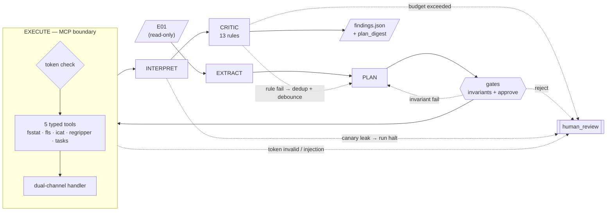

# Architecture — Find Evil Hackathon

**Last updated:** 2026-04-24
**Audience:** hackathon judges. Maintainers: see [architecture-detailed.md](architecture-detailed.md) for full schemas, data-flow walkthrough, and threat model.
**Visual:** [architecture.html](architecture.html) — styled pipeline diagram.

---

## At a glance

| | |
|---|---|
| **Pipeline** | `E01 → EXTRACT → PLAN → gates → EXECUTE(MCP) → INTERPRET → CRITIC → findings.json` |
| **What's shipped** | L2 end-to-end with 5/5 MCP tools, 11/13 active Critic rules (+ R_13 stub), LangGraph topology, Langfuse tracing, Slice 5 full stack (HTTP MCP transport, capability tokens, dual-channel handler, injection-quarantine wiring), 128-test pytest suite, **canary tripwire on the INTERPRET bundle** |
| **What's next** | Slice 6 (Reference Dataset + L3 ship + sampled-audit + Accuracy Report) · AI-adversary detection branch (staged-data demo) |
| **Headline trust claim** | *Replayable auditability for a research workflow, with explicit defender-AI integrity controls.* We defend the **agent's context** from injected evidence and **detect adversarial attempts to manipulate the defender LLM itself**; we do **not** defend the Python runtime from a hijacked agent. |
| **Out of scope** | Memory / network / evtx forensics · non-Windows filesystems · seccomp / microVM isolation · courtroom admissibility |

Status legend: ✅ shipped • 🟡 in progress • ⬜ defined, not built

---

## 1. The pipeline (one diagram)

Happy path is solid; retry is dotted; MCP is a subgraph inside EXECUTE. A more detailed four-diagram breakdown (retry, MCP zoom, cross-cutting audit) lives in [architecture-detailed.md §2](architecture-detailed.md#2-pipeline-diagrams).

**What each stage does, one line each:**

- **EXTRACT** — enumerate candidate artifact paths from the investigation question. Gemini 3.1 Flash Lite, JSON mode.
- **PLAN** — emit a typed `ToolPlan` with a `depends_on` DAG. Claude Sonnet 4.6, prompt-cached.
- **Gates** — structural invariants (e.g. every `regripper_run` must have an `icat_extract` upstream) + human approval at L1/L2, policy file at L3.
- **EXECUTE** — dispatch each tool via MCP. Capability token scoped to `(case_id, tools, paths, plan_digest, expiry)`. Dual-channel handler splits raw bytes (→ ledger), structured fields (→ agent), injection-flagged content (→ quarantine).
- **INTERPRET** — synthesize typed `Finding`s with DFIR classification. Pydantic `model_validator` auto-populates ATT&CK fields; LLM output on those fields is discarded. Per-run **canary tripwire** (`_canary` field embedded in the bundle): if the LLM response echoes the nonce, the instruction/data boundary leaked — write `CANARY_LEAK` audit entry and halt the run.
- **CRITIC** — 13 deterministic Python rules. Fail routes through **plan-hash dedup** (no sycophantic retry) then **pre_retry_debounce** (clear volatile state) back to PLAN or INTERPRET.

---

## 2. Component map

| Component | Status | Where |
|---|---|---|
| `EXTRACT` node (Gemini 3.1 Flash Lite) | ✅ | [`slice2.ipynb`](../../experiments/slice-2-notebook/slice2.ipynb) C5 |
| `PLAN` node (Claude Sonnet 4.6, cached) | ✅ | `slice2.ipynb` C6 |
| Structural invariants | ✅ | `slice2.ipynb` C6 |
| `plan_approve` gate | ✅ | LangGraph conditional edge |
| `EXECUTE` node + MCP stdio server | ✅ | `slice2.ipynb` C8 + [`mcp_server/server.py`](../../experiments/slice-2-notebook/mcp_server/server.py) |
| 5 typed MCP tools | ✅ | `mcp_server/server.py` |
| Capability-token verification | ✅ Slice 5 | `mcp_server/server.py` + [`pipeline/mcp/tokens.py`](../../experiments/slice-2-notebook/pipeline/mcp/tokens.py) |
| Dual-channel evidence handler | ✅ Slice 5 | `mcp_server/server.py` + [`pipeline/mcp/injection_scanner.py`](../../experiments/slice-2-notebook/pipeline/mcp/injection_scanner.py) |
| `INTERPRET` node | ✅ (lifted Slice 5 Step 7) | [`pipeline/nodes.py`](../../experiments/slice-2-notebook/pipeline/nodes.py) `interpret_node` |
| Canary tripwire (defender-AI integrity) | ✅ Tier-1 (2026-04-24) | [`pipeline/nodes.py`](../../experiments/slice-2-notebook/pipeline/nodes.py) `_check_canary_leak` + [`pipeline/graph.py`](../../experiments/slice-2-notebook/pipeline/graph.py) `mint_canary` |
| `CRITIC` node | ✅ 11 active + R_13 stub (Phase C) | [`pipeline/critic.py`](../../experiments/slice-2-notebook/pipeline/critic.py) + `pipeline/nodes.py` `critic_node` |
| `human_review` escalation sink | ✅ | `pipeline/nodes.py` `human_review_node` |
| `pre_retry_debounce` + plan-hash dedup | ✅ Phase C | `pipeline/nodes.py` `debounce_before_*` + `pipeline/graph.py` `plan_hash` |
| Thread-scoped checkpointer | 🟡 Phase C | `slice2.ipynb` C4 |
| Integrity ledger (SHA-256 linear hash chain) | ⬜ Slice 6 | separate from case folder |
| `verify_chain_of_custody.py` replay tool | ⬜ Slice 6 | |
| Langfuse tracing | ✅ | throughout |
| `score.py` precision/recall/hallucination | ✅ base / 🟡 autonomy metrics | [`score.py`](../../experiments/slice-2-notebook/score.py) |

---

## 3. Trust boundaries — what we do and do not claim

**Four layers. Each catches a different failure class.**

| Adversary | Defense |
|---|---|
| Prompt injection embedded in E01 content (filenames, registry values, document bodies) | **Dual-channel handler** — raw bytes go to the ledger, structured fields to the agent, flagged content to quarantine. The hijack payload never reaches the LLM context. |
| Adversarial attempt to manipulate the defender LLM itself (boundary leak: a structured-field escape persuading the model to treat data as instructions) | **Canary tripwire** — per-run random nonce (`_canary`) embedded in the INTERPRET bundle. If the response echoes the nonce, the instruction/data boundary leaked — the run is halted and a `CANARY_LEAK` audit entry is written. |
| LLM-internal failure (sycophancy, spec drift, silent tool-failure swallowing, hallucinated relationships) | **13-rule Critic + Hadi3 negative-case validation** |
| Accidental agent drift (proposes a tool or path outside scope) | **Capability tokens** at the MCP boundary — application-layer routing |
| Post-hoc tampering with recorded evidence | **SHA-256 linear hash chain** — altering entry N breaks the hash embedded in entry N+1 |

**Explicitly out of scope:** local root compromise · supply-chain attacks on packages / images / model providers · network-layer attackers · courtroom admissibility.

**The honest stdio caveat.** LangGraph and the MCP server run in the same container under the same UID. A successful prompt-injection that slipped past the dual-channel handler *could* reach `subprocess` via the Python runtime — capability tokens can't stop that because the hijacked agent is on the inside of the MCP transport. Capability tokens are *application-layer least-privilege routing*, **not** a cryptographic sandbox. Seccomp-BPF, eBPF-LSM, or microVM wrapping would close this gap; documented as an extension point, not in scope for 8 weeks. Full prose: [architecture-detailed.md §3c](architecture-detailed.md#3c-the-stdio-transport-nuance).

---

## 4. Autonomy climb

Components activate progressively. L4 (post-deployment Forensic Auditor) is **not** in the submission narrative.

| | L1 Assisted | L2 Guarded | L3 Exception-Based |
|---|---|---|---|
| `plan_approve` | human always | human always | policy file (auto unless flagged) |
| Critic retry loop | disabled (fail → human) | bounded retry | bounded + plan-hash dedup + debounce |
| Capability tokens | per-plan | per-plan | per-plan, shorter expiry |
| Dual-channel handler | active | active | active |
| Thread-scoped checkpointer | optional | recommended | required |
| Confidence rubric | advisory | advisory + escalate Low | auto-escalate Low |

**Headline: L2 shipped, L3 is the submission target.** Every slice of new autonomy is matched by a new gate.

---

## 5. Where detail lives

For anything below:

- **Data flow end-to-end (13 steps)** → [architecture-detailed.md §4](architecture-detailed.md#4-data-flow--one-case-end-to-end)
- **`PipelineState` field-level write/read discipline** → [architecture-detailed.md §5](architecture-detailed.md#5-pipelinestate-schema)
- **MCP tool schemas** → [architecture-detailed.md §6](architecture-detailed.md#6-mcp-tool-surface)
- **Critic rule catalog (R_01–R_13, what each catches, phase)** → [architecture-detailed.md §7](architecture-detailed.md#7-critic-rule-catalog-13-rules-r_01r_13)
- **What's deliberately out of scope** → [architecture-detailed.md §9](architecture-detailed.md#9-whats-deliberately-not-in-this-architecture)

When this page changes, edit `architecture-detailed.md` first — then roll the deltas up to here and to [architecture.html](architecture.html).
